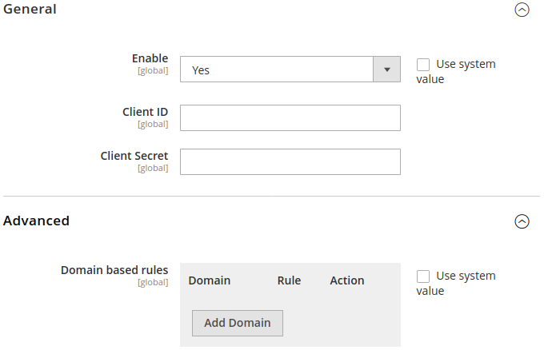
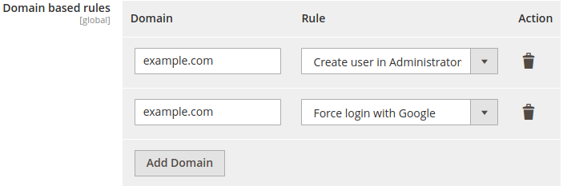
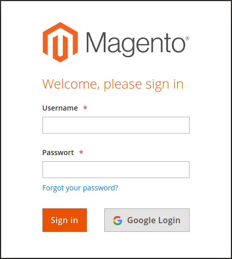

# Backend Google Sign On for Magento 2
This is a Magento 2 extension that allows to authenticate into Magento 2 Admin Panel using Google Sign On services.

## Installation
Install the extension through composer:

    composer require msp/module-backend-google-sign-on
    
Once Composer finishes installing the dependencies, run:

    bin/magento setup:upgrade

## Configuration
After the module is installed, authenticate into Admin Panel and go to `STORES > Settings > Configuration > SECURITY > Google Backend Sign On`.

You should see the following configuation fields:

To fill the **Client ID** ad **Client Secret** fields, go to https://console.developers.google.com/ to create the required **OAuth client ID** credentials (read detailed instructions [here](https://developers.google.com/identity/protocols/oauth2/javascript-implicit-flow?hl=it)).

As **Authorized JavaScript origins** set the base URL of the site where you are installing the extension.

As **Authorized redirect URLs** set the URL of the Admin Panel.

You can also define a set of domain-based rules to automatically assign a role to a user or to force a user to use the Google Sign On, as shown below:

## Usage
Once enabled and configured, the extension adds a **Google Login** button in the sign in form of the Admin Panel, as shown below:

## Contributing
Contributions are very welcome. In order to contribute, please fork this repository and [submit a pull request](https://help.github.com/articles/creating-a-pull-request/).

## License
Copyright © MageSpecialist - Skeeller srl. All rights reserved.
